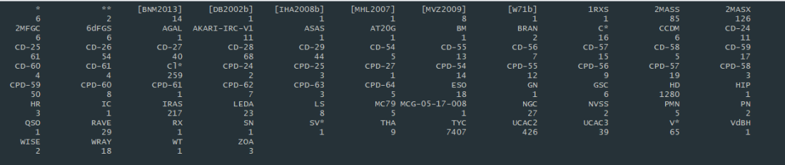
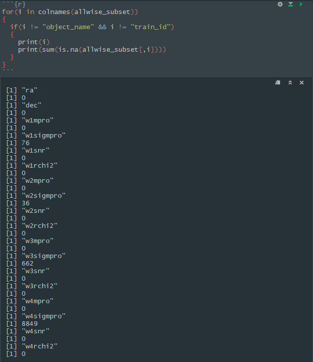
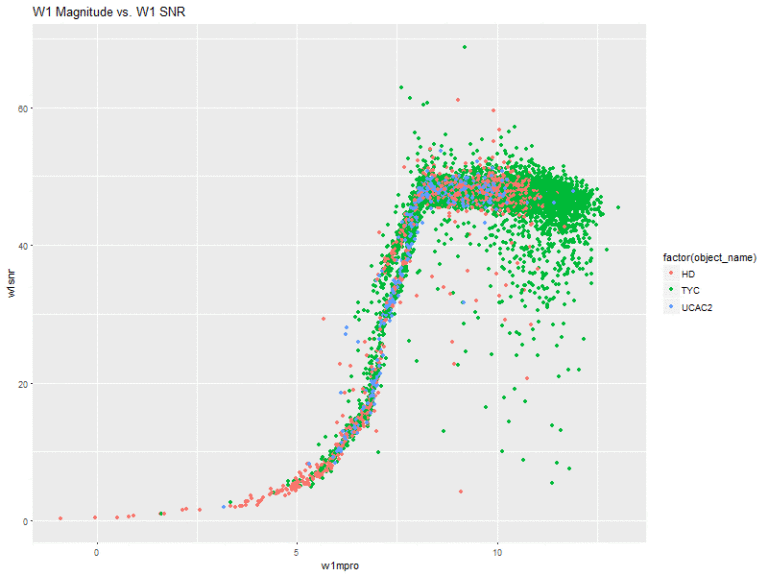
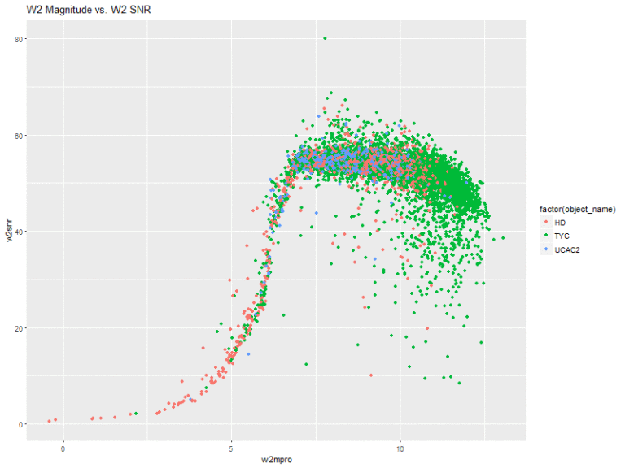
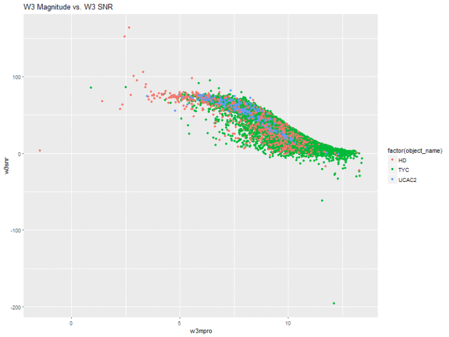
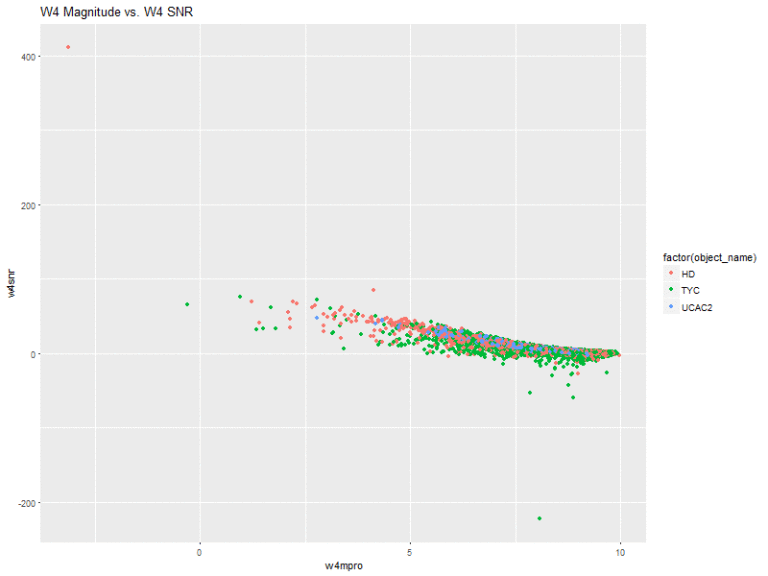

## What am I doing, exactly? 
Seeing which machine learning techniques and packages in the R language provide the best classification rates for astronomical objects. What else would I be doing?

This project is basically divided into three parts:

1. **Data Acquisition**: Counter-intuitively, the most difficult portion of the entire process. Wait, all you have to do is download a dataset and open it up, right? Wrong. Especially with astronomical datasets and their obscure documentation designed for specialists. We will see how I created some Python scripts to solve my data problem.
2. **Classification with ML Techiques**: I will be testing and benchmarking the performance and results of several machine learning algorithms which have been built into R. 
3. **Conclusion and Discussion**: The results of the machine learning techniques may be able to provide some insight into which technique may be best for classifying astronomical data with flux measurements, and we might be able to figure out why that is as well.

## ALLWISE Background

The Wide-field Infrared Survey Explorer (WISE), is a NASA owned and operated infrared wavelength astronomical space telescope. The ALLWISE data release (2013) contains positions, apparent motion measurements, four-band fluxes, and flux variability statistics for over **747 million objects**. The measurements and positions for stellar nurseries, star clusters, galaxies, supernovae, minor planets, brown dwarfs, etc, are all contained within the ALLWISE data release.

## Data Acquisition
My first step in this process was acquiring the WISE data. Luckily, this was pretty straight forward. I did this by going to the following [catalog page](http://irsa.ipac.caltech.edu/cgi-bin/Gator/nph-dd) and specifying that I wanted to query objects within a certain Right Ascension (RA) and Declination (DEC). RA and DEC are essentially the equivalent of longitude and latitude, except they are used for the sky. These queries produced large sets of astronomical data. However, there was one problem - the objects had a unique ID designation, but no unique class designation (i.e. star, galaxy, etc.), and hence, could not be classified categorically. This is where SIMBAD came in.

The SIMBAD astronomical database was created by merging astronomical objects from many different catalogs. My professor and I stumbled across it when we encountered the previously mentioned problem, and decided that it was our only chance of getting unique labels for the ALLWISE dataset.

The SIMBAD website has a feature where one can upload a table of RA and DEC measurements to get associated matches in the SIMBAD database within a certain angular area. However, this feature was restricted to a few hundred objects at a time, which meant it was practically useless for dealing with hundreds of thousands of objects.

After doing some research, I encountered [Astropy](http://www.astropy.org/) - a library in Python for computational astronomy. Essentially, I created a python script using this library, which worked by feeding in thousands of RA and DEC measurements from a text file, and stored resulting matches from SIMBAD into a new file (after going through the tedious process of parsing and decoding the data structures that are specific to AstroPy).

Unfortunately, querying SIMBAD this way was mind-numbingly slow, and the script would sometimes stop halfway through because of a resulting no-match error. I could not reach my goal of getting 100,000 objects to work with, so I settled at 10,645 objects. I figured this was okay, primarily because the distribution of object types would not be much different if I were to have thousands of more objects - there would simply be thousands of more objects of the same kind (I was able to test this by querying different RA and DEC ranges and looking at their matched contents). Perhaps in the future I can build a much larger dataset. I was unable to find any source on where the highest concentrations of objects are (in terms of RA and DEC) in the SIMBAD catalog.

## The Working Dataset

<figure>
    
</figure>

The original dataset was comprised of 10,645 objects. However, as you can see from the above image, some of the categories comprised an extremely small percentage of the entire dataset and were not worth including. In the final, working dataset, I chose to include only 3 categories of astronomical objects with a substantial count to be included in the analysis: TYC (7,407), HD (1,280), and UCAC2 (426).

It was at this point in the project that I realized my dataset was now comprised completely of stars due to the fact I could use only 3 categories. So much for classifying other astronomical objects. However, this could prove to be interesting as well. Let’s take a look at some information I acquired from doing research on the object ID’s.

* **TYC** - Stars from a catalog comprised of the 2.5 million brightest stars, [TYCHO2](https://heasarc.nasa.gov/W3Browse/all/tycho2.html). “The satellite, which operated for four years, returned high quality scientific data from November 1989 to March 1993”
* **HD** - Stars from the [Henry Draper Catalog](https://en.wikipedia.org/wiki/Henry_Draper_Catalogue). This is a very old dataset of stars, published between 1918 and 1924!
* **UCAC2** - Stars from [The Second U.S. Naval Observatory CCD Astrograph Catalog](http://www.nofs.navy.mil/data/fchpix/ucac2_readme.html). “The UCAC is an observational program, using the U.S. Naval Observatory Twin Astrograph and a 4k by 4k CCD camera, covering just over one square degree per frame with a scale of 0.9″/pixel.”

Essentially, my goal at this point was to use machine learning techniques to see if I could predict which catalog a given star was from based on the following parameters for each object:

* **w1mpro, w2mpro, w3mpro, w4mpro** – Flux magnitudes measured with profile-fitting photometry for the W1 – W4 bands.
* **w1sigmpro, w2sigmpro, w3sigmpro, w4sigmpro** – W1 – W4 profile-fit photometric measurement uncertainty in units of magnitude.
* **w1snr, w2snr, w3snr, w4snr** – Profile–fit measurements of signal-to-noise ratio of the W1 – W4 bands. Ratio of the flux to flux uncertainty.
* **w1rchi2, w2rchi2, w3rchi2, w4rchi2** – Reduced χ2 of the W1 – W4 profile-fit photometry measurements.

## Upsampling: Accounting for an Unbalanced Dataset

As previously mentioned, the resulting dataset included a predominant number of TYC objects compared to the much smaller count of HD and UCAC2. This would’ve definitely caused problems in the analysis (for example, I would’ve gotten good results on predictions simply because the majority of the dataset is comprised of one object).

To account for this, I used a method called upsampling, whereby I sampled from the smaller categories with replacement such that HD and UCAC2 had the same number of observations as TYC. Below is the snippet of code that I used to do this.

```r
#UPSAMPLING: Sample with replacement to get equal number of HD and UCAC2 as TYC
hd_sample <- allwise_subset_hd[sample(nrow(allwise_subset_hd), replace = TRUE, 7407), ]
ucac2_sample <- allwise_subset_ucac2[sample(nrow(allwise_subset_ucac2), replace = TRUE, 7407), ]
#Create new dataset by stacking TYC, HD, and UCAC2 on top of each other
bind1 <- rbind(allwise_subset_tyc, hd_sample)
allwise_subset <- rbind(bind1, ucac2_sample)
allwise_subset <- allwise_subset[sample(1:nrow(allwise_subset)),] #shuffle this new dataset
```
By using this technique, my final working dataset was **22,221** observations in size.

## Accounting for NA's

I encountered another issue with the data while attempting model regularization. There were several missing data points in a few columns of the dataset. I used the following code to give me an exact count of the missing values in the dataset.

<figure>
    
</figure>

As we can see here, the “sigmpro” columns are the ones with the missing values. w4sigmpro had far too many missing values, so I chose to completely do away with this column altogether. For the other three columns, I simply replaced the missing values with the mean value of the column itself.

My dataset was now complete for analysis.

## Analysis Outline 

I first began by exploring the data to see if I could see any visual patterns. Next, I ran the data through multiple machine learning models in R, bench marking the performance of each one and noting the best tuning parameters for each. The following is an outline of my methodology.

* **Graphical Exploration**
* **Model Regulzarization**
* **Gradient Boosted Tree Model**
* **Multinomial Logistic Regression**
* **K-Nearest Neighbors**
* **Elastic Net**
* **Keras - Neural Network**

## Graphical Exploration

Typically, it is a great idea to explore the data you are working with in a visual way, so the data takes on a shape instead of being a massive collection of numerical values. Additionally, it can also provide you with patterns you would otherwise be unaware of.

I began by visualizing the locations of the data in terms of their RA and DEC measurements. The plot is color coded to indicate the three catalogs of star classes that I am working with. This plot gave me a good idea of where the bands I took my samples from were located in terms of RA and DEC space.

<figure>
    
</figure>

Next, I created plots of the magnitude of the 4 bands vs. their respective signal-to-noise ratios.

<figure>
    
</figure>

<figure>
    
</figure>

<figure>
    
</figure>

<figure>
    
</figure>

This is actually pretty interesting! The w1 and w2 bands have very similar shapes. That is, they slope upwards and sort of level off. With these two, there seems to be a very general pattern (with several outliers, of course), that the higher the flux magnitude, the higher the signal-to-noise ratio. The stars from the HD catalog also seem to comprise a greater amount of the stars with lower flux measurements.

The W3 and W4 bands also share a similar shape, where all of the stars are sort of clumped together in the same space.

## Model Regularization

I was working with quite a few variables, and I wasn’t entirely sure what all of the variables meant at an in-depth level. I used ridge regression to get a better understanding of the relationship between the column values and the three different classes of stars. Using glmnet, I set alpha = .9

```r
model <- cv.glmnet(X, y, alpha = .9)
coef(model)
```

Resulting in:

```
(Intercept) -0.3457489291
w1mpro      -4.5530130557
w1sigmpro    5.3442081035
w1snr        0.0075583125
w1rchi2     -0.0145319292
w2mpro       4.9524022882
w2sigmpro   -6.6748653304
w2snr       -0.0045750131
w2rchi2      0.0231618420
w3mpro      -0.2175302760
w3sigmpro    0.1950131896
w3snr        0.0147527776
w3rchi2     -0.0004217059
w4mpro      -0.0328130618
w4snr       -0.0057611262
w4rchi2      0.0021244808
```

From this preliminary analysis, it looked like w1mpro and w2sigmpro were highly negatively correlated with the star class, while w1sigmpro and w2mpro were positively correlated. The rest of the variables were slightly positively or negatively correlated. This was valuable information for the future models that I would build, as I didn’t want to introduce noise into the models by supplying them with useless data.

## Gradient Boosted Trees

**XGBoost**, as its documentation states, “is used for supervised learning problems, where we use the training data (with multiple features) to predict a target variable.”

I first created my relevant X and y data structures containing the validation and training data.

```r
X <- model.matrix(~ . - 1, data = allwise_subset[,4:18])
y <- allwise_subset$sclass

X_train <- X[allwise_subset$train_id == "train",]
y_train <- y[allwise_subset$train_id == "train"]
X_valid <- X[allwise_subset$train_id == "valid",]
y_valid <- y[allwise_subset$train_id == "valid"]

data_train <- xgb.DMatrix(data = X_train, label = y_train)
data_valid <- xgb.DMatrix(data = X_valid, label = y_valid)
watchlist <- list(train=data_train, valid=data_valid)
```

I then created the model. I was trying to put the stars into 3 different categories, so I set the objective of the model equal to multi:softmax. The maximum depth of the tree was set to 3 to avoid any drastic overfitting. Using a depth of 2, however, resulted in a worse training and validation rate.

An eta value of .5 seemed to work well in this particular case, and 1000 rounds also seemed to be ideal, at least for getting a great validation rate.

```r
model <- xgb.train(data = data_train,
                   max_depth = 3, eta = 0.4, nthread = 4,
                   nrounds = 1000, objective = "multi:softmax",
                   num_class = 4, watchlist = watchlist,
                   print_every_n = 100)
```

The **xgboost** model gave me fantastic results – some of the best results out of all of the techniques that I used, although the model ended up being slightly overfit, with a 100% training classification rate. However, the 94% testing rate was not bad at all.

```r
allwise_subset$object_pred <- predict(model, newdata = X)
tapply(allwise_subset$object_pred == allwise_subset$sclass,
       allwise_subset$train_id, mean)
```
```
test: 0.9455288
train: 1.0000000
valid: 0.9511091
```

## Multinomial Logistic Regression

My next model was the classic regression.

Since I was trying to place the stars into three categories, it was no longer a linear regression problem. I used the nnet package and the multinom function in R to perform multinomial logistic regression on my dataset.

Recall that the previous ridge regression showed w1mpro, w1sigmpro, w2mpro, and w2sigmpro to have the highest values.

I first created a model using only these variables, and then calculated the classification rate.

```r
model <- multinom(sclass ~ poly(w1mpro, w1sigmpro, w2mpro, w2sigmpro, degree = 3), data = allwise_subset)

allwise_subset$object_pred <- predict(model, newdata = allwise_subset)
tapply(allwise_subset$object_pred == allwise_subset$sclass, allwise_subset$train_id, mean)
```
```
test: 0.6790740
train: 0.6902292
valid: 0.6754187
```

Interestingly enough, a third degree polynomial seemed to work best with this data. The validation rate was nowhere near as good as the gradient boosted tree.

I then created a model using all of the predictor variables, instead of just the most highly correlated ones.

```r
model <- multinom(sclass ~ poly(w1mpro, w1sigmpro, w1snr, w1rchi2, w2mpro, w2sigmpro, w2snr, w2rchi2, w3mpro, w3sigmpro, w3rchi2, w4mpro, w4snr, degree = 3), data = allwise_subset, MaxNWts = 1683)

allwise_subset$object_pred <- predict(model, newdata = allwise_subset)
tapply(allwise_subset$object_pred == allwise_subset$sclass, allwise_subset$train_id, mean)
```
```
test: 0.7158420
train: 0.7215048
valid: 0.7080127
```

As we saw earlier in the ridge regression model, all of the variables in the dataset had some sort of correlation with the class of the star, regardless of how small the amount was. I believe this is why including everything in the model leads to a very modest increase in the classification rate. Note how close it is to the model using only the most highly correlated variables, however.

## K-Nearest Neighbors

The k-nearest neighbors approach works by categorizing each point with whatever category is more prominent within the nearest *k*-training points.

I was curious to see how well this would work with my star data.

In order to use the **knn** function from the R **FNN** package, I first created a model matrix.

```r
X <- as.matrix(allwise_subset[,4:18])
y <- allwise_subset$sclass
X_train <- X[allwise_subset$train_id == "train",]
y_train <- y[allwise_subset$train_id == "train"]
```

I then ran the k-nearest neighbors algorithm and calculated the classification rate.

```r
allwise_subset$object_pred <- knn(train = X_train, test = X,
                     cl = y_train, k = 2)
tapply(allwise_subset$object_pred == allwise_subset$sclass, allwise_subset$train_id, mean)
```
```
test: 0.8851578
train: 0.9430091
valid: 0.8847989 
```

I experimented with playing around with the *k* parameter. Very high values of *k* led to a worse validation rate. *K* being set equal to 2 seems to yield the best validation rate while not overfitting. Overall, the knn model performed quite well when compared with other models such as multinomial regression.

Before finishing the k-nearest neighbors analysis, I wanted to confirm that I had the optimal value of *k*. I did this by fitting the knn algorithm for 25 values of *k*, from 1 to 25. As we can see in the plot, a value of *k* somewhere between 1 and 2 yields the lowest RMSE score, so my *k* = 2 seems like an ideal choice in this model.

```r
rmse <- rep(NA, 25)
for (k in seq_along(rmse)) {
  y_valid_pred <- knn.reg(train = X_train, y = y_train,
                          test = X_valid, k = k)$pred
  rmse[k] <- sqrt( mean((y_valid_pred - y_valid)^2) )
}

qplot(seq_along(rmse), rmse) +
  geom_line() +
  theme_minimal()
```

<figure>
    
</figure>

## Elastic Net using glmnet

The Elastic Net is a regularized regression method that solves the limitations of both lasso and ridge regression.  I used the glmnet package in R to create an elastic net model for my predictions.

As usual, I first started by creating the training data for the model.

```r
X <- as.matrix(allwise_subset[,4:18])
y <- allwise_subset$sclass
X_train <- X[allwise_subset$train_id == "train",]
y_train <- y[allwise_subset$train_id == "train"]
```

I then used glmnet to create the model and make predictions with it.  I opted to leave the lambda argument as its default value.

```r
model <- cv.glmnet(X_train, y_train, family = "multinomial")
allwise_subset$object_pred <- predict(model, newx = X, type="class", alpha=.2)

tapply(allwise_subset$object_pred == allwise_subset$sclass, allwise_subset$train_id, mean)
```
```
test: 0.6598870
train: 0.6607654
valid: 0.6744803
```

For this particular dataset, the elastic net performed about as well as the multinomial regression - i.e., not very well.  Furthermore, it took a long time to run, making it an even worse choice to use when predicting for the ALLWISE dataset.

## Neural Network with Keras

Neural networks seem to be popular with the cool CS kids these days.  Unfortunately, neural networks did not work too well for classifying this dataset.  I've had much more success in the past with using neural networks for text and image classification.

I created my training data, making sure to specify the number of classes as 3.

```r
X <- as.matrix(allwise_subset[,4:18])
y <- allwise_subset$sclass - 1
X_train <- X[allwise_subset$train_id == "train",]
y_train <- to_categorical(y[allwise_subset$train_id == "train"], num_classes = 3)
```

Now came the fun part.  Getting good neural network prediction results is largely based on experimentation with different numbers of layers, neurons, and other various techniques.  I knew that my dataset was relatively small, so using more than a single layer would not yield good results.  I even tried it.  There was also no need for fancy neural networks such as convolutional or recurrent. 

At the end I settled for the model below with the following characteristics:
* a dense network with 128 neurons in the primary layer
* "selu" ("relu" gave slightly worse results) and "softmax" layer activations
* learning rate of 0.00005

A smaller learning rate generally provided good results up to a point.  Additionally, 10 epochs seemed to be an ideal number - anything lower and I started getting drops in the testing value.  The neural network certainly leveled out in its learning of the dataset - for example, 20 epochs really didn't have much effect with respect to the classification rate.

```r
model <- keras_model_sequential()
model %>%

  layer_dense(units = 128, 
              input_shape = c(15)) %>%
  layer_activation(activation = "selu") %>%
  layer_dropout(rate = 0.5) %>%

  layer_dense(units = 3) %>%
  layer_activation(activation = "softmax")

model %>% compile(loss = 'categorical_crossentropy',
                  optimizer = optimizer_sgd(lr = 0.00005, momentum = .9,
                                            nesterov = TRUE),
                  metrics = c('accuracy'))

history <- model %>%
  fit(X_train, y_train, epochs = 10, validation_split = 0.2)
```
Despite trying to fine tune the neural network, I ended up with classifications rates that aren't exactly remarkable.  This is okay - my data is simply not designed for predictions using a neural network.

```
test: 0.5442039
train: 0.5422979
valid: 0.5259376
```

## Cumulative Results

<table style="width:75%">
  <tr>
    <th>ML Technique</th>
    <th>Train</th> 
    <th>Test</th>
    <th>Valid</th>
  </tr>
  <tr>
    <td>Gradient Boosted Tree</td>
    <td>1.0000000</td>
    <td>0.9455288</td>
    <td>0.9511091</td>
  </tr>
  <tr>
    <td>Multinomial Logistic Regression</td>
    <td>0.6902292</td>
    <td>0.6790740</td>
    <td>0.6754187</td>
  </tr>
  <tr>
    <td>K-Nearest Neighbors</td>
    <td>0.9430091</td>
    <td>0.8851578</td>
    <td>0.8847989</td>
  </tr>
  <tr>
    <td>Elastic Net</td>
    <td>0.6607654</td>
    <td>0.6598870</td>
    <td>0.6744803</td>
  </tr>
  <tr>
    <td>Neural Network</td>
    <td>0.5422979</td>
    <td>0.5442039</td>
    <td>0.5259376</td>
  </tr>
</table>

<br>

For my custom made, ALLWISE dataset, the Gradient Boosted Tree model wins.  It makes sense that such an algorithm would work well for this dataset, because the prediction task on the dataset has the following characteristics:
* it's a supervised learning task
* it's a classification task

The other reasons why this model may outperform the rest?  I can make a guess, but it probably wouldn't be accurate, so let's stick with what we know and let the numbers speak for themselves.
