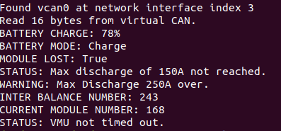

## Some Cans are Hard to Open

I'm currently working on a project for my employer that involves interfacing with external hardware components to monitor and control multiple batteries.

A CAN Bus is one of the components that will be present in this system.  We currently do not have access to the CAN Bus, so I wanted to create somewhat of a simulation to learn more about how everything will work using pure software. 

Basically, this write up will show you how to do the following:

* Create a Virtual CAN on your Linux operating system to be used as a socket to read and write data frames
* Use the SocketCAN Linux drivers in a C program to write custom data frames containing various Battery Management Unit (BMU) status messages to the virtual CAN, as well as read these data frames
* Create a simplified and made up data frame model closely resembling the data frames used in production level BMUs.

## Introduction to SocketCAN and CANs in General

You can't talk about SocketCAN without first knowing what a CAN actually is.

**CAN** stands for Controller Area Network, and it is a standard often used in vehicles that allows microcontrollers and devices to communicate with one another without a host computer.

On the other hand, we have something called **SocketCAN**, developed by Volkswagen Research, which has been contributed to the Linux Kernal.  SocketCAN utilizes the network device model to allow multiple applications to access one CAN device simultaneously.  Apparently, traditional CAN Linux drivers utilize the *character driver* device model - SocketCAN does not.

## Creating the Virtual CAN

So, this part is pretty straight forward assuming you have a linux operating system.  Here is a short script that I created which loads the required kernal modules and makes the virtual CAN.

```bash
#!/bin/bash

echo "NOTE: Script must be run with root permissions."
echo "Loading required kernal modules..."

modprobe can
modprobe can_raw
modprobe vcan

echo "Linking a virtual CAN to vcan0..."

ip link add dev vcan0 type vcan
ip link set vcan0 up

echo "Done."
```

We're adding a networking device called *vcan0* which is a virtual can, i.e. *vcan*.  This will serve as the CAN that we read and write from.

You can use `ifconfig` to make sure it is up and running after you run the script.

## Creating a Mock BMU Data Frame

Battery management systems that communicate via a CAN usually have hardware specific data frame communication structures that they use to send and receive messages.  The mock data frame structure that we will make somewhat resembles the Valence battery system.  While creating this, I referenced the datasheet to see how messages are composed and which bits correspond to which battery status identifiers.

In practice, the vehicle management unit will be reading these status messages and measurements from the battery management system.

The data frame that we are going to make has the following characteristics:

* The data frame is an array of 8 bytes total
* Each element in the array contains 8 bits, each of which is a binary digit
* Each element in the array represents either a battery management quanitity or a status message

From an abstracted point of view, the data frame will look like this:

```
[ {BATTERY CHARGE}, 
  {MODE}, 
  {MODULE LOST}, 
  {MAX 150A ALARM}, 
  {MAX 250A ALARM}, 
  {CURRENT MODULE NUMBER}, 
  {INTER BALANCE NUMBER}, 
  {VMU TIME OUT} ]
```

Let's talk about each of these elements.

* **BATTERY CHARGE:** These bits represent a number corresponding to the percentage of charge left on the batteries.  In this example, we will be using *01001110* or 78%
* **MODE:** These bits contain the current mode of the batteries, which will be one of three things: Standby, Charge, or Drive.  Out of the 8 bits, what we are concerned with are the final two bits, which will either be 00 (standby), 01 (charge), or 10 (drive).  The other 6 bits can remain 0, and we can think of them as spare bits or placeholders.
* **MODULE LOST:** This tells us that the battery management system is unable to communicate with a battery module.  We are concerned with the final bit, which will either be 1 (module lost) or 0 (module not lost).
* **MAX 150A ALARM:** This tells us that the discharge current in the batteries is over 150A.  We are concerned with the final bit in this case as well, with 1 indicating that the discharge in the batteries is over 150A and a 0 indicating it is not.
* **MAX 250A ALARM:** This tells us that the discharge current in the batteries is over 250A.  To change things up, we are concerned with the 6th bit, with a 1 indicating that the discharge current in the batteries is over 250A, and a 0 indicating this is not the case.  As I previously explained, the rest of the bits can just be set to 0.
* **CURRENT MODULE NUMBER:** This tells us that the number of battery modules the system is communicating with.  In this example, we can use *11110011* or 243.
* **INTER BALANCE NUMBER:** This tells us the number of modules that are enabling their inter balance circuits.  What does this mean?  No fucking clue; like I said, I took some information from a datasheet for simulation purposes.  Let's say we have 168 modules, or *10101000*.
* **VMU TIME OUT:** This means that the vehicle management unit has timed out.  We are concerned with the 4th bit, with a 1 indicating that the VMU has timed out and a 0 indicating it has not.

## Creating BMU Status Messages

Using the above information, we can start by creating a header file in C that contains macros for the various options we will want to use in our program.  The messages will be represented in hex notation.

``` c
/*
 * Defines various BMU status message in hex
 * BMU_Status_Macros.h
 */

// [BYTE 1]
#define BATTERY_CHARGE 0x4E     // 01001110 (78%)

// [BYTE 2]
#define BMU_MODE_STANDBY 0x0    // 00000000
#define BMU_MODE_CHARGE 0x1     // 00000001
#define BMU_MODE_DRIVE  0x2     // 00000010

// [BYTE 3]
#define MODULE_LOST 0x1         // 00000001
#define MODULE_NOT_LOST 0x0     // 00000000

// [BYTE 4]
#define MAX_150A_ALARM 0x1      // 00000001
#define MAX_150A_NO_ALARM 0x0   // 00000000

// [BYTE 5]
#define MAX_250A_ALARM 0x4      // 00000100
#define MAX_250A_NO_ALARM 0x0   // 00000000

// [BYTE 6]
#define CURRENT_MODULE_NUM 0xF3 // 11110011 (243)

// [BYTE 7]
#define INTER_BALANCE_NUM 0xA8  // 10101000 (168)

// [BYTE 8]
#define VMU_TIMED_OUT 0x10      // 00010000
#define VMU_NOT_TIMED_OUT 0x0   // 00000000
```

## Writing to the Virtual CAN

Now we can create a C program that utilizes the status messages and the mock data frame we have made to simulate a BMU writing to the CAN.

This C program is going to use the Volkswagen Research SocketCAN driver.  I referenced the extensive kernal documentation [here](https://www.kernel.org/doc/html/v4.17/networking/can.html) while making this program.

I've tried to include some helpful comments in the program, but it may also be helpful to explain what is happening step by step at a high level.

* We are first opening a socket to communicate over the CAN network using the RAW socket protocol provided by the driver.
* We are then using the *ioctl* system protocol to get low level access to our network device of interest.
* We are then binding to the socket of our virtual CAN, *vcan0*, to write our data frame.
* Finally, we write the data to the virtual CAN.

``` c
#include <stdio.h>
#include <stdlib.h>
#include <unistd.h>
#include <string.h>

#include <net/if.h>
#include <sys/types.h>
#include <sys/socket.h>
#include <sys/ioctl.h>

#include <linux/can.h>
#include <linux/can/raw.h>

#include "BMU_Status_Macros.h"

/* 
 * Simulates a BMU (battery management unit) to write to a 
 * virtual CAN.
 * BMU_Status_Writer.c
 */

#define VCAN "vcan0"
#define CAN_ID 0x123

int main(int argc, char* argv[]) 
{
  	// Interface with virtual CAN
  	int s;
	int num_bytes;
	struct sockaddr_can addr;
	struct can_frame frame;
	struct ifreq ifr;

	const char* vcan_name = "vcan0";
	if((s = socket(PF_CAN, SOCK_RAW, CAN_RAW)) < 0) {  // open socket for communication
    	perror("Error while opening socket");
    		return -1;
  	} 

  	strcpy(ifr.ifr_name, vcan_name);
  	ioctl(s, SIOGIFINDEX, &ifr);      // low level access to network device
  					  // put index of vcan0 into 's'

  	addr.can_family = AF_CAN;
  	addr.can_ifindex = ifr.ifr_ifindex;

  	printf("Found %s at network interface index %d\n", vcan_name, ifr.ifr_ifindex);

  	// bind to the socket of vcan0 to write
  	if(bind(s, (struct sockaddr*)&addr, sizeof(addr)) < 0) {
    		perror("Error in socket bind");
    		return -2;
  	}

  	frame.can_id = CAN_ID;
  	frame.can_dlc = 8;                 // number of bytes we're writing

  	frame.data[0] = BATTERY_CHARGE; 
  	frame.data[1] = BMU_MODE_CHARGE; 
  	frame.data[2] = MODULE_LOST; 
  	frame.data[3] = MAX_150A_NO_ALARM; 
  	frame.data[4] = MAX_250A_ALARM; 
  	frame.data[5] = CURRENT_MODULE_NUM; 
  	frame.data[6] = INTER_BALANCE_NUM; 
	frame.data[7] = VMU_NOT_TIMED_OUT; 

	// write bytes of size can_frame to network device vcan0
	num_bytes = write(s, &frame, sizeof(struct can_frame));

	printf("Wrote %d bytes to virtual CAN.\n", num_bytes);

	return 0;
}
```

## Reading from the Virtual CAN

Now, we need to make a C program that will simulate the vehicle management unit, or the system that will be reading and parsing the messages from the BMU that are sent to the virtual CAN.

In the program, here is what is happening at a high level.

* Like the program that did the writing, we are opening a socket and then binding to the socket to read data from.
* For each byte of the data frame, we are reading the bits and comparing them to the messages in hex we defined in our macro file.  We are then printing the results of the read, or printing and error if the bytes are unable to be read.

Here is the code for this C program.

``` c
#include <stdio.h>
#include <stdlib.h>
#include <unistd.h>
#include <string.h>

#include <net/if.h>
#include <sys/types.h>
#include <sys/socket.h>
#include <sys/ioctl.h>

#include <linux/can.h>
#include <linux/can/raw.h>

#include "BMU_Status_Macros.h"

/* Allows reading information from a virtual CAN that was 
 * previously written to from the BMU (battery management unit)
 *
 * In a real setting, the VMU (vehicle management unit) would
 * read these data frames.
 */

#define VCAN "vcan0"
#define CAN_ID 0x123

int main(void)
{
	// Interface with virtual CAN
	int s;
	int num_bytes;
	struct sockaddr_can addr;
	struct ifreq ifr;

	const char* vcan_name = "vcan0";
	if((s = socket(PF_CAN, SOCK_RAW, CAN_RAW)) < 0) {
        	perror("Error while opening socket");
        	return -1;
	} 
	
	strcpy(ifr.ifr_name, vcan_name);
	ioctl(s, SIOGIFINDEX, &ifr);      // low level access to network device
    								  // put index of vcan0 into 's'
	addr.can_family = AF_CAN;
	addr.can_ifindex = ifr.ifr_ifindex;

	printf("Found %s at network interface index %d\n", vcan_name, ifr.ifr_ifindex);

	// bind to the socket of vcan0 to read
	if(bind(s, (struct sockaddr*)&addr, sizeof(addr)) < 0) {
        	perror("Error in socket bind");
        	return -2;
    	}
	
	struct can_frame frame;

	num_bytes = read(s, &frame, sizeof(struct can_frame));

	if(num_bytes < 0) {
    		perror("Cannot read CAN socket.");
    		return 1;
    	}

	printf("Read %d bytes from virtual CAN.\n", num_bytes);

	read_battery_state(frame);
    	read_bmu_mode(frame);
    	read_battery_status_byte_three(frame);
    	read_battery_status_byte_four(frame);
    	read_battery_status_byte_five(frame);
    	read_battery_status_byte_six(frame);
    	read_battery_status_byte_seven(frame);
    	read_battery_status_byte_eight(frame);

    	return 0;
}

/* Check for the % of battery charge in byte 1 */
void read_battery_state(struct can_frame data_frame) 
{
	__u8 battery_byte = data_frame.data[0];

	printf("BATTERY CHARGE: %d%\n", battery_byte);
}

/* Check if the BMU is in standby, charge, or drive mode in byte 2 */
void read_bmu_mode(struct can_frame data_frame) 
{
	__u8 bmu_mode_byte = data_frame.data[1];

	switch(bmu_mode_byte)
	{
		case BMU_MODE_STANDBY:
			printf("BATTERY MODE: Standby\n");
			break;

		case BMU_MODE_CHARGE:
			printf("BATTERY MODE: Charge\n");
			break;

		case BMU_MODE_DRIVE:
			printf("BATTERY MODE: Drive\n");
			break;
	}
}

/* Check for module lost */
void read_battery_status_byte_three(struct can_frame data_frame)
{
	__u8 byte_three = data_frame.data[2];

	switch(byte_three)
	{
		case MODULE_LOST:
			printf("MODULE LOST: True\n");
			break;

		case MODULE_NOT_LOST:
			printf("BATTERY MODE: False\n");
			break;

		default:
			printf("ERR: Cannot read data frame byte three.\n");
			break;
	}
}

/* Check for MAX Discharge 150A Over Current Alarm */
void read_battery_status_byte_four(struct can_frame data_frame)
{
	__u8 byte_four  = data_frame.data[3];

	switch(byte_four)
	{
		case MAX_150A_ALARM:
			printf("WARNING: Max Discharge 150A over.\n");
			break;

		case MAX_150A_NO_ALARM:
			printf("STATUS: Max discharge of 150A not reached.\n");
			break;

		default:
			printf("ERR: Cannot read data frame byte four.\n");
			break;
	}
}

/* Check for MAX Discharge 250A Over Current Alarm */
void read_battery_status_byte_five(struct can_frame data_frame)
{
	__u8 byte_five  = data_frame.data[4];

	switch(byte_five)
	{
		case MAX_250A_ALARM:
			printf("WARNING: Max Discharge 250A over.\n");
			break;

		case MAX_250A_NO_ALARM:
			printf("STATUS: Max discharge of 250A not reached.\n");
			break;

		default:
			printf("ERR: Cannot read data frame byte five.\n");
			break;
	}
}

/* Check for Inner balance num */
void read_battery_status_byte_six(struct can_frame data_frame)
{
	__u8 byte_six   = data_frame.data[5];

	printf("INTER BALANCE NUMBER: %d\n", byte_six);
}

/* Check for Current module num */
void read_battery_status_byte_seven(struct can_frame data_frame)
{
	__u8 byte_seven = data_frame.data[6];

	printf("CURRENT MODULE NUMBER: %d\n", byte_seven);
}

/* Check for VMU timeout */
void read_battery_status_byte_eight(struct can_frame data_frame)
{
	__u8 byte_eight = data_frame.data[7];

	switch(byte_eight)
	{
		case VMU_TIMED_OUT:
			printf("WARNING: VMU timed out.\n");
			break;

		case VMU_NOT_TIMED_OUT:
			printf("STATUS: VMU not timed out.\n");
			break;

		default:
			printf("ERR: Cannot read data frame byte eight.\n");
			break;
	}
}

```

## Running the Simulation

* First, we need to make sure that we set up the virtual CAN using the script provided at the beginning
* Next, we can compile both of our C programs using `gcc`

```bash
gcc -o BMU_Status_Reader BMU_Status_Reader.c 
gcc -o BMU_Status_Writer BMU_Status_Writer.c 
```

* Then we want to run our reader program.  This program is going to stay running while listening in on the virtual CAN socket until something is written to it.

`./BMU_Status_Reader`

* Finally, we want to write to the virtual CAN, so we can run our writing program in another terminal tab.

`./BMU_Status_Writer`

Printed to the console in the terminal where the reading program was exectured should be the information regarding the status of the BMU, as shown below.

<figure>
    
</figure>
