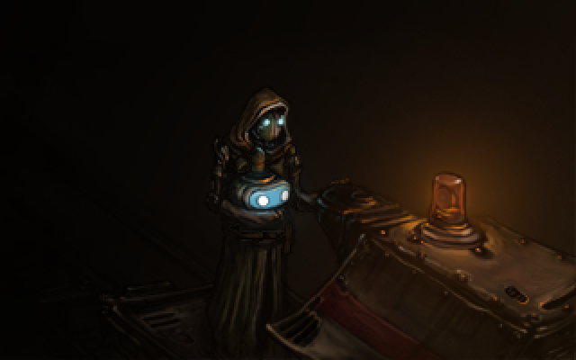
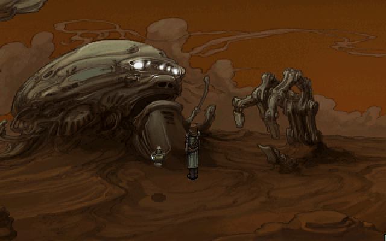
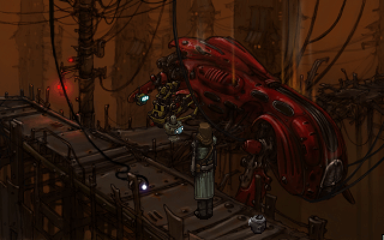

I'm going to cut straight to the point.

This is the best point-and-click game I've played. I haven't played a ton, so perhaps that's not saying much, but I think this game is much more than the sum of its parts, where each of those parts is masterfully crafted in their own right.

## Characters and Dialogue

The characters and the dialog are the apotheosis of Primordia.

I was shocked at how well done the characterizations of Horatio and his sidekick were (I'm desensitized to the kind of characters you find in most modern games, after all). They are congruent in their beliefs and behavior most of the time while allowing for slight deviations and quirks when the situation calls for it. In other words, they are not flat, two-dimensional characters that serve as cliches or archetypes or devices to allow for the advancement of the plot. They feel real and alive, and it might fly under the radar at first glance because of the subtlety with which it is implemented.

<figure>
    
    <figcaption>Source: http://www.wadjeteyegames.com/games/primordia/</figcaption>
</figure>

Horatio and Crispin may be the highlights of the game since they are the main characters, but that does not mean that the rest of the characters you can interact with in the game were sort of swept under the rug as an afterthought. No, each of them has their own distinct personality and motivations as well, and none of them, in my opinion, are overdone, underdone, obnoxious, or boring. I enjoyed interacting with all of them and their dialogue never overstayed its welcome, which brings me to my next point.

The writing in this game is smart, witty, and entertaining. It's a pleasure to read, it's immersive, and you look forward to the next exchange of words between characters. This is the hallmark of good writing - when you're able to savor the text and voice acting instead of skimming and quickly clicking through to get to the next exciting plot point.

And it's genuinely funny at times. I have an obscure sense of humor and it takes a lot to make me go from not cracking a smile to a slight smirk. But this game did it. Some of the absurd stuff Horatio, Crispin, and other characters would say to each other was so well done. If sentient machines with personalities had a great sense of humor, this would be it. It pays a nice homage to people who have dealt with computer programming as well (Horatio, at one point, sarcastically compares something unfavorable Crispin suggests with having unbalanced parentheses somewhere inside of him). This programming humor has the potential to be unfunny and cringe-worthy as it usually is in your typical office space or classroom, but the delivery was smooth and self-aware enough to make it work.

## Art

If you're reading this review, you already know what the art looks like. Yes, it's heavily pixelated and low resolution. But of course, that's part of the aesthetic. I couldn't really imagine Primordia being a game with high resolution artwork and animations. It just wouldn't be the same. I wouldn't like it as much. The way it's done is perfect for the atmosphere and setting, I think, and I wouldn't change a thing. If you like this retro, low-resolution aesthetic, it's all the more reason to buy the game.

<figure>
    
    <figcaption>Source: http://www.wadjeteyegames.com/games/primordia/</figcaption>
</figure>

A few times throughout the experience, you view higher-resolution cut scenes at important moments. It's a pretty large contrast to the pixelated art you're used to seeing, and when you come across these cut scenes, they seem magical and intriguing because you get to see what the characters really look like. It reminds me of the contrast between looking underwater with and without goggles. Both are cool in their own right, but the comparison our brain makes between the two perceptions is where the wonder exists.

## Story

The story of Primordia was unorthodox and interesting. Perhaps not groundbreaking or original on all fronts, but well developed enough to warrant a playthrough even if the character and dialogue features described above were toned down a few notches.

<figure>
    
    <figcaption>Source: http://www.wadjeteyegames.com/games/primordia/</figcaption>
</figure>

My favorite part about it is that it's stripped of the extraneous to the extent to where you don't get bogged down in the details and can just enjoy the plot as it unfolds.

It's not very self-revealing until towards the end, where you encounter the truth and a few twists along the way. The story of Horatio was hinted at a few times earlier in the game, but the way it was fleshed out at the end was a satisfying and cathartic ending to a journey of self-discovery and knowledge.

Two of the endings were very good. The rest were ok. I recommend you save at a certain point in the game where you're given the option to  and reload it to get the rest of the endings.

## Puzzles

The gameplay of Primordia is centered around its puzzle mechanics. You cannot progress forward until you solve them.

The solutions to the puzzles require creativity, backtracking, and odd combinations.

Unless you want to spend a lot of time exhausting all possible options, you may want to use a guide at some points, because a few of the puzzles were so non-trivial that it was hard to find a lead on where to even start or gain a hint from short of wandering around and trying random things. When I consulted a guide to find out what to do at a few places, I was like "How was I supposed to come to this conclusion?" In some places, it's like you need preconceived knowledge to move forward. I'd like to think I'm not a dumbass, but maybe I am, and maybe you will have an easier time.

That said, I'd prefer the difficulty of these puzzles over having boring and generic ones. If you like problem solving in the context of an interesting plot and likeable characters, well, here is your game.

## Primordia

I've tried to break this game down into its constituent components so you can more easily evaluate the game. However, the experience of Primordia, like I said at the beginning of the review and like all good creative works should be, is more than the sum of its parts. So don't take everything at face value.

You'd have to play it to know what I mean, and I cannot recommend you do so highly enough, especially if you're a fan of point and clicks, non-obvious puzzles, sci-fi, or just entertaining characters and dialogue.

Other games in the same genre will have to step up their ingenuity if they want to compete with these developers and writers. This game is highly deserving of its overwhelmingly positive reviews.

Looking forward to what they put out next.
